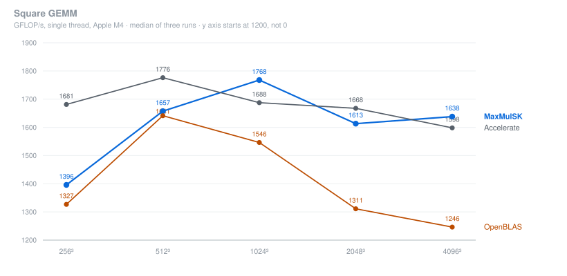
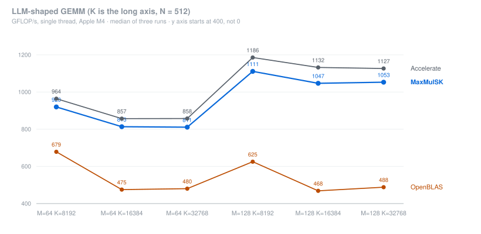
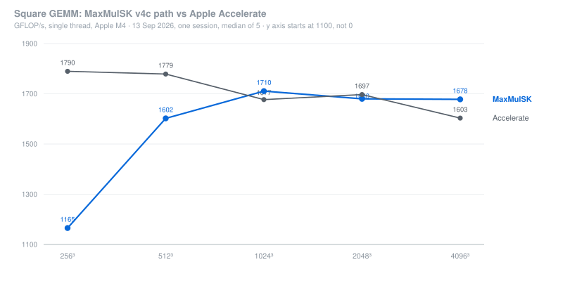
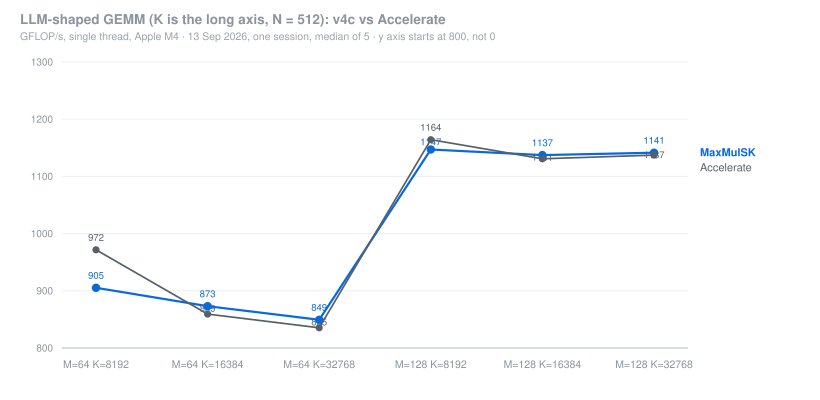
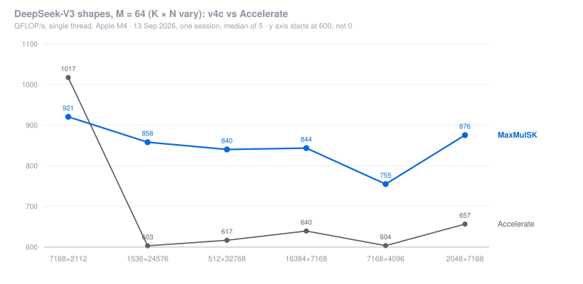
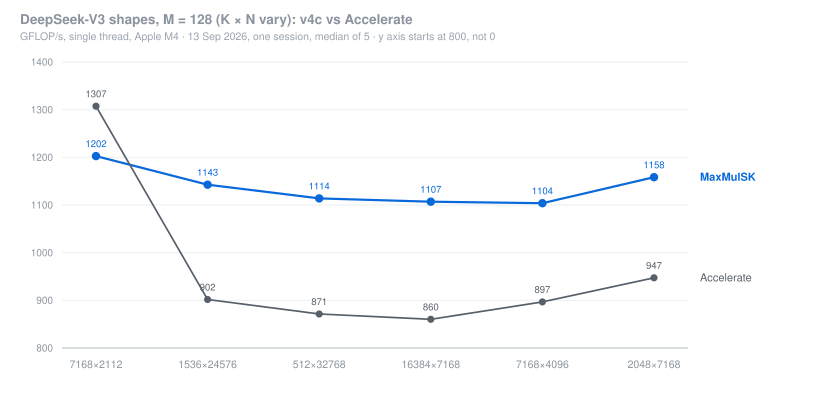
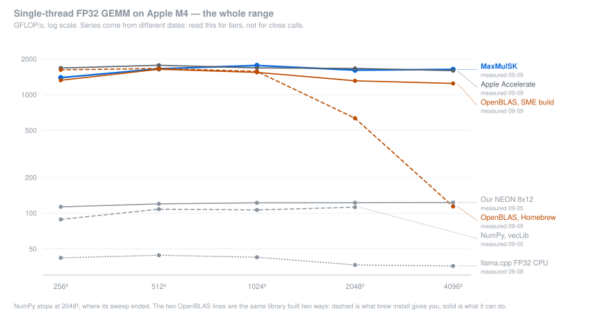

# MaxMulSK

A single-threaded FP32 GEMM library for Apple M4, written against Arm SME/SME2.

This is not just a micro-kernel. MaxMulSK handles the whole execution path. It
packs A and B into kernel-friendly layouts, blocks the work over M, K and N for
cache, runs the ZA outer-product compute, deals with partial tiles at the edges,
and writes ZA back to C. You pass three pointers and three sizes.

  

## Results

- **~2.0 TFLOP/s** in the raw SME micro-kernel. That is 2008 to 2010 GFLOP/s of
  pure compute, isolated by fitting `t(Kc) = a + b·Kc` and reading the slope.
- **1.40 to 1.77 TFLOP/s** end to end on square GEMM, from 256³ to 4096³.
  Packing, blocking and writeback are all inside the timed region.
- **Faster than tuned OpenBLAS on every Apple M4 FP32 workload tested.**
  1.01× to 1.31× on squares and 1.36× to 2.23× on LLM-shaped matrices. The
  OpenBLAS it is measured against was built so that it reaches its own SME
  kernels.
- **In the same band as Apple Accelerate.** Narrowly but consistently ahead at
  1024³ and 4096³, by 1.05× and 1.02×, in all three runs at both shapes. Behind
  it by 5 to 17% on the other shapes.





<sub>Apple M4, single thread, FP32. Median of three runs with cooldowns between
them; the spread between runs was 0.1 to 2.1%. Both charts crop the y axis to
the data, at 1200 for squares and 400 for the LLM shapes, because starting at
zero squeezes everything into an unreadable band. They use points rather than
bars on purpose. A point shows its value by position, so cropping the axis is
fine. A bar shows its value by length, so cropping it would exaggerate every
difference. Every marker is labelled with its number. Raw data is in
[bench/results/2026-09-09/](bench/results/2026-09-09/).</sub>









<sub>The newer v4c path (`sme/v4/`) against Apple Accelerate on 13 September
2026: one session, same binary, call order rotated, median of 5 runs, AC power.
OpenBLAS was not part of that session. The DeepSeek-V3 shapes are the MpGEMM
paper's table; the 6 LLaMA shapes from the same run (N = 256) are not charted
here: v4c is behind Accelerate on them by 3 to 5%. Raw data:
[bench/results/2026-09-13/v4c3.csv](bench/results/2026-09-13/v4c3.csv).</sub>

---

> Hey, it's Ulaş. If you're wondering why this project exists in the first place
> when Accelerate and OpenBLAS already do, the answer is pretty simple: I like
> building things myself, I like using my own code, and I genuinely enjoy
> optimization work. So this project is a direct result of those reasons.
>
> It turned out much better than I expected. If you're looking for an
> open source FP32 GEMM library for Apple M4 and just want to call a fast matrix
> multiplication routine, I honestly believe MaxMulSK is now one of the best
> options out there.

---

## Benchmarking and comparison

| | Shape | MaxMulSK | Accelerate | OpenBLAS | vs Accelerate | vs OpenBLAS |
|---|---|---:|---:|---:|---:|---:|
| square | 256³ | 1395.7 | **1681.2** | 1326.7 | 0.83× | 1.05× |
| | 512³ | 1657.4 | **1776.2** | 1641.4 | 0.93× | 1.01× |
| | 1024³ | **1767.8** | 1687.7 | 1546.4 | **1.05×** | 1.14× |
| | 2048³ | 1613.2 | **1667.5** | 1311.2 | 0.97× | 1.23× |
| | 4096³ | **1638.2** | 1598.3 | 1246.3 | **1.02×** | 1.31× |
| llm | 64×8192×512 | 919.9 | **964.3** | 678.5 | 0.95× | 1.36× |
| | 64×16384×512 | 813.5 | **857.0** | 475.2 | 0.95× | 1.71× |
| | 64×32768×512 | 810.9 | **857.5** | 480.3 | 0.95× | 1.69× |
| | 128×8192×512 | 1111.2 | **1185.9** | 625.4 | 0.94× | 1.78× |
| | 128×16384×512 | 1047.0 | **1132.2** | 468.4 | 0.92× | 2.23× |
| | 128×32768×512 | 1052.9 | **1126.7** | 488.1 | 0.93× | 2.16× |

GFLOP/s, single thread. Generated by `bench/bench_headline.cpp`.

### What is compared, and how

**Apple Accelerate** and **OpenBLAS** are the end-to-end baselines. Both are
complete GEMM libraries that you call the same way you call MaxMulSK, so
comparing them side by side is fair.

**Arm KleidiAI** is deliberately left out of the table. KleidiAI ships
micro-kernels and packing routines, not a blocked end-to-end GEMM. To benchmark
it end to end you have to give it a blocking strategy. If we give it ours, the
result says more about our blocking than about KleidiAI. It belongs in the
micro-kernel and prepacked comparisons instead, where the units match
([§0.6 to §0.9](docs/BENCHMARKS.md)). This repo does contain hybrid runs, such
as KleidiAI's kernel driven by MaxMulSK's panel blocking, but those are
ablations. They exist to separate cause from effect and are never quoted as
headline numbers.

**NumPy and PyTorch** are reference points only. Both route through a vendor
BLAS, so neither is an independent implementation.

<details>
<summary><b>The wider landscape</b>: every FP32 GEMM path on this machine, three orders of magnitude</summary>

<br>



There are three tiers here. The top band holds the implementations that use a
matrix extension. The bottom band holds the ones that do not: our own NEON
kernel at its ceiling, NumPy's vecLib path, and llama.cpp's native FP32 CPU
path.

The two OpenBLAS lines are the **same library, built two different ways**. The
dashed line is what `brew install openblas` gives you today. It falls off a
cliff above 1024³. The solid line is the same source, built so that it can reach
its own SME kernels. Both lines are shown because they answer different
questions: the dashed one is what you get from a default install, and the solid
one is what the library can do when built for this hardware. The cause
is a size threshold that was calibrated against a kernel which is no longer the
alternative ([§0.16](docs/BENCHMARKS.md)).

Unlike the two charts above, this one is assembled from **runs on different
dates**, and NumPy's sweep stops at 2048³. Each series is dated on the chart.
Read it for tiers, not for close calls. Anything within about 2× belongs to the
headline benchmark, which measures its rows together in one process.

</details>

Ground rules for every number here:

- same hardware, same process, single thread, FP32 throughout
- warmup before timing, cooldown between runs, and nothing allocated or
  initialised inside a timed region
- three runs, median reported, with the per-row spread next to it
- **the order of the implementations rotates between timing blocks**, so none of
  them keeps the cache warm for the next one
- correctness checked on every run against a reference. C is prefilled with a
  sentinel value, so a tile that never gets written cannot pass silently
- micro-kernel, packing and full end-to-end costs are measured separately,
  because they answer different questions

This machine has no thread pinning, and the variance between runs can reach 12%
on the worst shapes. Differences under about 5% are not treated as real.

Full methodology, every dated result including superseded ones, and the
experiments that failed: **[docs/BENCHMARKS.md](docs/BENCHMARKS.md)**.

## Usage

```cpp
#include "sme/v3/sme-1x4-acc-kcout.hpp"

// C = A * B, row-major FP32. A is M x K, B is K x N, C is M x N.
// Packing, cache blocking, edge tiles and the ZA->C writeback all happen inside.
// C is OVERWRITTEN, so there is no need to zero it first.
SMEKernels1x4AccKcOut::run_multiplication(A, B, C, M, K, N);
```

Any M, N and K work. Partial output tiles go through a scratch-buffer fallback,
which costs nothing on aligned sizes. Blocking parameters are picked per shape
from a small table in [`sme/support/gemm_tuning.hpp`](sme/support/gemm_tuning.hpp).
That table only holds entries that beat the default across three separate runs.

## Kernel evolution

There are five generations. Each one targets whatever was actually limiting the
one before it.

| Generation | When | What changed | Bottleneck it attacked | Result |
|---|---|---|---|---|
| Prototype | 2026-01 | Matrix type, naive triple loop, first OpenMP pass | none yet, just correctness | ~2.6 GFLOP/s |
| **NEON 8×12** | 2026-04 | 8×12 micro-kernel, packing, cache blocking, in-register transpose | scalar code leaving SIMD unused | ~123 GFLOP/s, ~98% of the NEON ceiling |
| **v1, SME** <br><sub>4×1, 2×2, 1×4, 1×4-sym</sub> | 2026-04 → 07 | ZA outer-product accumulators, BLIS-style M/K/N blocking, four tile geometries | SIMD registers being the wrong tool for a matrix product | ~1200–1330 GFLOP/s |
| **v2, Acc** <br><sub>1×4-Acc, 1×4-Acc-Kc</sub> | 2026-09-06 | ZA lifetime lifted out of the micro-kernel: K innermost, ZA held across all of K, read-modify-write dropped from the store, store turned row-major, pack_A moved to a ZA transpose | per-call fixed cost, **357 ns → 52 ns** | 1773 at 1024³, but full-K packing cost it 4096³ and large K |
| **v3, Acc-KcOut** <br><sub>all three geometries</sub> | 2026-09-09 | An outer Kc panel above the tile nest, so packed panels scale with Kc instead of K | v2's full-K packing footprint | **1.40–1.77 TFLOP/s** across the range |

The fixed-cost reduction in v2 and v3 is worth a closer look, because it scales
with the tile geometry in a way that has a clear explanation:

| Geometry | Output tile | Fixed cost | ZA→C stores |
|---|---|---|---|
| 1×4 | 16×64 | 357 → **52 ns** | 64 → 16 |
| 2×2 | 32×32 | 358 → **98 ns** | 64 → 32 |
| 4×1 | 64×16 | 358 → **191 ns** | 64 → 64 |

All three start from the same place and do identical arithmetic, at 2002 to 2010
GFLOP/s of pure compute. What separates them is how wide the ZA tiles let the
writeback be. The 1×4 tile is 4·SVL across, so one row drains in a single
`svst1_f32_x4`. The 4×1 tile is one vector wide, so there is nothing to widen.

### Ideas that did not work, and one belief that turned out to be false

These are kept in `sme/experimental/`. They are useful because each one measured
something, even though none of them made the code faster.

- **Pack once and reuse** (`acc-fast`, `acc-fast-kcout`). The idea was to pack A
  and B for the whole matrix instead of per tile. It gained nothing, and it lost
  on large-K shapes. The bigger buffer is colder than the small one it replaced.
- **Skip pack_B entirely** (`bdirect`). It turns out pack_B is a pure copy, so
  the micro-kernel can read B in place with a stride instead. Results came out
  bit-identical, and performance dropped 66% at 4096³. The copy itself is cheap;
  what it buys is a contiguous layout for the inner loop, and that turns out to
  be worth far more than the copy costs.
- **1×4ZAIO and 4×1-ZAPack.** v1-era experiments, superseded by v2 and v3.
- **"The gap to Accelerate is hardware."** This was believed for months. It
  rested on Accelerate using AMX, a separate coprocessor. Sampling the program
  counter inside `cblas_sgemm` found 0 AMX-dominated samples out of 583 at
  4096³, which points the other way. A major part of the gap turned out to be
  per-call fixed cost. While the hardware explanation stood, there was no reason
  to look for that cost, so it went unexamined
  ([§0.17](docs/BENCHMARKS.md)).

## Project layout

<details>
<summary>Full source tree</summary>

```
MaxMulSK/
├── common/
│   ├── utils.hpp                  # fill_random, check_correctness, compute_gflops, scalar reference
│   └── Matrix.hpp                 # Generic matrix class (addition, subtraction)
├── neon/
│   ├── neon-8x12.hpp/.cpp         # NEON 8×12 kernel + packing + OpenMP driver
│   └── test_neon.hpp/.cpp         # Packing + GEMM correctness vs scalar
├── sme/                               # grouped by generation; v3 is current
│   ├── v1/                            # ZA lifetime lives inside the micro-kernel
│   │   ├── sme-4x1.hpp/.cpp           # 4×SVL × 1×SVL tile, A-inner
│   │   ├── sme-2x2.hpp/.cpp           # 2×SVL × 2×SVL tile, interleaved B packing
│   │   ├── sme-1x4.hpp/.cpp           # 1×SVL × 4×SVL tile, x1 interleaved B loads
│   │   └── sme-1x4-sym.hpp/.cpp       # same tile, x4-grouped B loads (true mirror of 4×1)
│   ├── v2/                            # ZA lifetime lifted into the driver: K innermost,
│   │   ├── sme-1x4-acc.hpp/.cpp       #   ZA held across all of K, overwriting row-major
│   │   └── sme-1x4-acc-kc.hpp/.cpp    #   store, ZA-transpose pack_A. Costs full-K packing.
│   ├── v3/                            # v2 + an OUTER Kc loop, which fixes that packing cost
│   │   ├── sme-1x4-acc-kcout.hpp/.cpp # 1×4 geometry, the fastest of the three
│   │   ├── sme-2x2-acc-kcout.hpp/.cpp # 2×2 geometry
│   │   └── sme-4x1-acc-kcout.hpp/.cpp # 4×1 geometry
│   ├── experimental/                  # measured, kept, NOT on the fast path
│   │   ├── v1/sme-1x4-sym-zainout     #   ZA-resident K accumulation, K_inner_tile=40
│   │   ├── v1/sme-4x1-zapack          #   4×1 with ZA-based pack_A, M_tile=128
│   │   ├── v2/sme-1x4-acc-fast        #   pack A and B once for the whole matrix
│   │   ├── v3/sme-1x4-acc-fast-kcout  #   same, per K panel
│   │   └── v3/sme-1x4-acc-kcout-bdirect #  no pack_B at all, B read in place
│   └── support/
│       ├── gemm_tuning.hpp/.cpp       # shape-dependent blocking table
│       └── test_sme.hpp/.cpp          # dispatch surface: run / run_comparison / profile
├── bench/
│   ├── bench_headline.cpp         # MaxMulSK vs Accelerate vs OpenBLAS, one run, the table above
│   ├── plot_headline.py           # renders the two SVGs from that run's CSVs
│   ├── bench_compare.cpp          # C++ comparison: NEON / SME / Accelerate / OpenBLAS
│   ├── bench_python.py            # Python comparison: NumPy / PyTorch
│   ├── bench_profile.cpp          # Single-library driver (accel|oblas) for profiling scripts
│   ├── bench_profile.py           # Single-library driver (numpy|pytorch)
│   ├── run_bench.sh               # Build + run both comparison benchmarks
│   ├── benchmark_maxmul_vs_kleidiai.cpp  # Layered: hot micro-kernel / prepacked / end-to-end / panel / ggml
│   ├── maxmulsk_sme_adapter.hpp/.cpp     # Uniform dispatch over our SME kernels + prepacked and hot-tile harnesses
│   ├── kleidiai_gemm.hpp/.cpp            # Arm KleidiAI fp32 SME2 wrapper (full-pack and panel-blocked callers)
│   ├── ggml_gemm_baseline.hpp/.cpp       # llama.cpp/ggml CPU baseline, native and KleidiAI dispatch paths
│   ├── energy_bench.cpp/.sh/_parse.py    # W, J and J/GFLOP per implementation per shape
│   ├── grand_benchmark.sh                # Runs every benchmark into one dated directory
│   ├── grand_summary.py                  # Aggregates a run directory into SUMMARY.md
│   ├── average_runs.py                   # Median across repeated runs + per-row spread
│   └── results/                          # Dated result archive; nothing here is deleted
├── experiments/
│   └── matmul.cpp                 # Standalone N=2048 head-to-head: our SME kernel vs Accelerate
├── scripts/
│   ├── run.sh                     # Build + run main binary
│   ├── run_matmul.sh              # Build + run the matmul experiment (vs Accelerate)
│   ├── profile.sh                 # Instruments PMU profiling (L1 misses, INST_ALL)
│   └── profile_power.sh           # powermetrics-based energy profiling
├── docs/
│   ├── BENCHMARKS.md              # Every measurement, dated; superseded results marked, not removed
│   └── COMPARISON.md              # Historical 2026-04 snapshot, kept for the progression
├── main.cpp                       # Test runner + benchmark harness
├── TODO.md                        # Roadmap + fixed-bug archive
└── GemmTemplate.tracetemplate     # Xcode Instruments template (PMU counter list)
```

</details>

## Requirements

- Apple M4. The SME kernels need SME/SME2
- LLVM/Clang, via `brew install llvm`. Apple's bundled Clang lacks the SME/SME2 intrinsics
- libomp, via `brew install libomp`
- CMake 3.30+
- OpenBLAS, via `brew install openblas`, for `bench_compare` and `bench_headline`. It is loaded with `dlopen`, so it is optional at runtime. The Homebrew build cannot reach its own SME GEMM kernels. To compare against OpenBLAS at its best, build `develop` with `DYNAMIC_ARCH=1` and point `OPENBLAS_DYLIB` at it ([§0.16](docs/BENCHMARKS.md))
- Python with `numpy` and `torch`, needed only for `bench_python.py`
- **Arm KleidiAI**, fetched and built automatically at a pinned tag (`v1.30.0`). Turn it off with `-DMAXMULSK_WITH_KLEIDIAI=OFF`, or point at an existing checkout with `-DFETCHCONTENT_SOURCE_DIR_KLEIDIAI=...`
- **llama.cpp / ggml** *(optional)*, only needed for the ggml CPU baseline rows. Build it CPU-only, then point CMake at it

The build finds the toolchain instead of hardcoding paths. You can override any of it:

```bash
cmake -B build -DCMAKE_CXX_COMPILER=/path/to/clang++   # different compiler
HOMEBREW_PREFIX=/custom/prefix cmake -B build          # non-standard Homebrew
OPENBLAS_DYLIB=/path/to/libopenblas.dylib ./bench/run_bench.sh
PYTHON=/opt/anaconda3/bin/python ./bench/run_bench.sh  # interpreter with numpy+torch
```

For the llama.cpp/ggml baseline, build ggml with every external accelerator
turned off, so the rows measure ggml's own CPU path. Then point CMake at it:

```bash
cmake -S llama.cpp -B llama-build -DCMAKE_BUILD_TYPE=Release \
      -DBUILD_SHARED_LIBS=OFF \
      -DGGML_METAL=OFF -DGGML_ACCELERATE=OFF -DGGML_BLAS=OFF \
      -DGGML_CPU_KLEIDIAI=ON -DGGML_OPENMP=OFF
cmake --build llama-build --target ggml-cpu ggml-base ggml

cmake -B cmake-build-release -S . \
      -DLLAMA_CPP_DIR=llama.cpp -DLLAMA_CPP_BUILD_DIR=llama-build \
      -DLLAMA_CPP_KLEIDIAI_LIB=llama-build/_deps/kleidiai-build/libkleidiai.a
```

`GGML_CPU_KLEIDIAI=ON` adds a second ggml row that dispatches to KleidiAI's fp32
SME2 kernel. Without it, only ggml's native path is measured. Note that ggml
pins its own KleidiAI version, v1.24.0, independent of the one this repo
fetches.

## Build and run

```bash
# The headline comparison — MaxMulSK vs Accelerate vs OpenBLAS
cmake --build cmake-build-release --target bench_headline
OPENBLAS_NUM_THREADS=1 VECLIB_MAXIMUM_THREADS=1 \
    ./cmake-build-release/bench_headline out.csv
python3 bench/plot_headline.py docs/img out.csv        # regenerate the charts

# Main binary (NEON tests + the SME suites it wires up + comparison + timing breakdown)
./scripts/run.sh

# Everything, into bench/results/<date>/
./bench/grand_benchmark.sh
./bench/grand_benchmark.sh --power-only   # energy only, reusing an existing directory

# Layered head-to-head (hot micro-kernel / prepacked / end-to-end / panel / ggml)
cmake --build cmake-build-release --target benchmark_maxmul_vs_kleidiai
./cmake-build-release/benchmark_maxmul_vs_kleidiai out.csv

# Single-thread competitor comparison (NEON / SME / Accelerate / OpenBLAS / NumPy / PyTorch)
./bench/run_bench.sh

# Instruments PMU profiling — saves traces/<name>.txt
./scripts/profile.sh 4x1
./scripts/profile.sh --binary cmake-build-release/bench_profile \
                     --args "accel 2048 2048 2048 100" accel

# Energy / thermal profiling — saves traces/<name>_power.txt (sudo for powermetrics)
sudo ./scripts/profile_power.sh --no-build 4x1
```

`./scripts/run.sh` runs the NEON unit tests, the NEON speed sweep, the SME kernel
suites wired into that binary (pack correctness, then GEMM correctness, then
benchmark), the cross-kernel comparison, and the 4×1 timing breakdown.

## Future work

- [ ] Dynamic tiling
- [ ] SME multi-threading
- [ ] Re-profile 1×4-sym vs 4×1 with PMU counters to explain the B-inner turnaround
- [ ] Apply the shape-dependent blocking table to the 2×2 and 4×1 v3 kernels (it was tuned on 1×4 only)
- [ ] Report the stale OpenBLAS direct-path threshold upstream

Completed work is in [TODO.md](TODO.md), including every bug that was fixed
along the way and its root cause.

## More

- [Benchmarks, methodology and the full result history](docs/BENCHMARKS.md)
- [Historical 2026-04 comparison snapshot](docs/COMPARISON.md)
- [Roadmap and fixed-bug archive](TODO.md)
- [Raw result archive](bench/results/)

## License

Licensed under the [Apache License, Version 2.0](LICENSE).

```
Copyright 2026 Ulaş Sertan KEMEÇ

Licensed under the Apache License, Version 2.0 (the "License");
you may not use this file except in compliance with the License.
You may obtain a copy of the License at

    https://www.apache.org/licenses/LICENSE-2.0

Unless required by applicable law or agreed to in writing, software
distributed under the License is distributed on an "AS IS" BASIS,
WITHOUT WARRANTIES OR CONDITIONS OF ANY KIND, either express or implied.
See the License for the specific language governing permissions and
limitations under the License.
```
